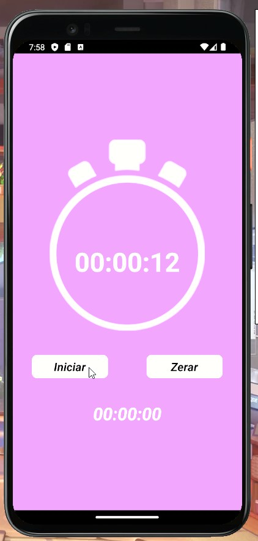
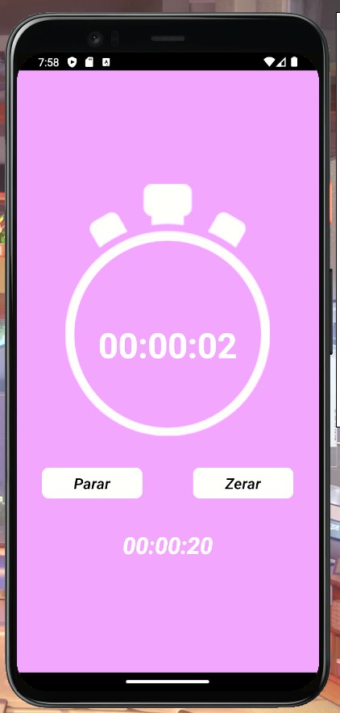

## ⏱Crono App (Stopwatch)
* O aplicativo Crono é uma ferramenta simples e eficaz que permite aos usuários marcar o tempo de acordo com suas necessidades. Seja para medir intervalos de treinamento, o tempo de preparo de alimentos, ou simplesmente manter o controle do tempo em várias situações.
* The Crono app is a simple and effective tool that allows users to mark time according to their needs. Whether to measure training intervals, food preparation time, or simply keep track of time in various situations.

  
  

## Download⬇️
* <a href="src/ReadmeSrc/cronometro_video.mp4" download>Download do vídeo de demonstração do app</a>
* <a href="src/ReadmeSrc/cronometro_video.mp4" download>Download a demo video of the app here</a>

## Tecnologias (Technologies)💻
* React Native

## Contato (Contact me)🔗
* Email: gabriel.avilaa27@gmail.com
* LinkedIn: https://www.linkedin.com/in/gabriel-avila-10a077218/
